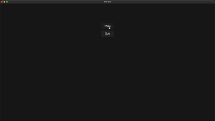
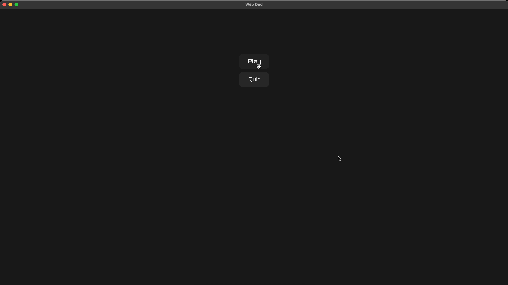
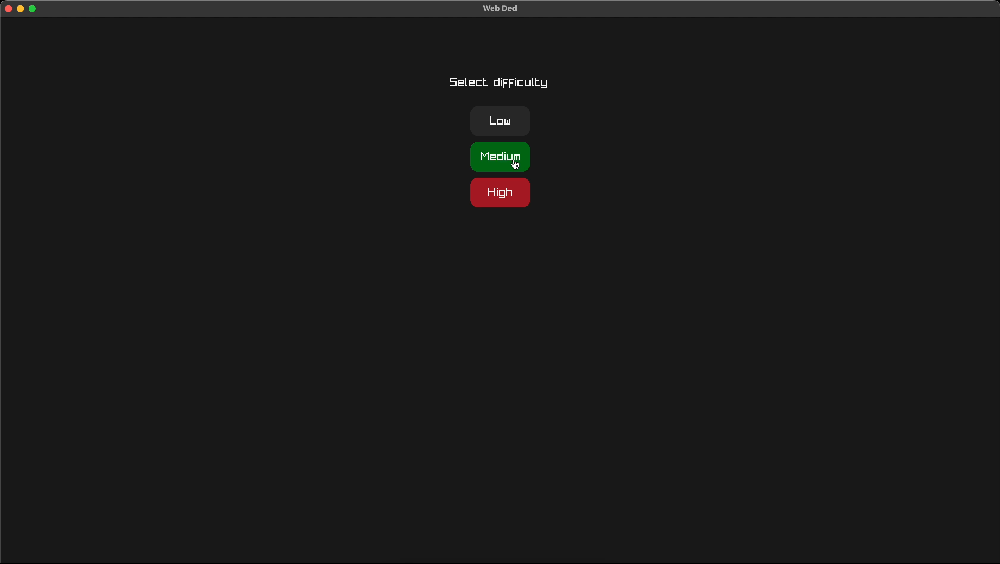
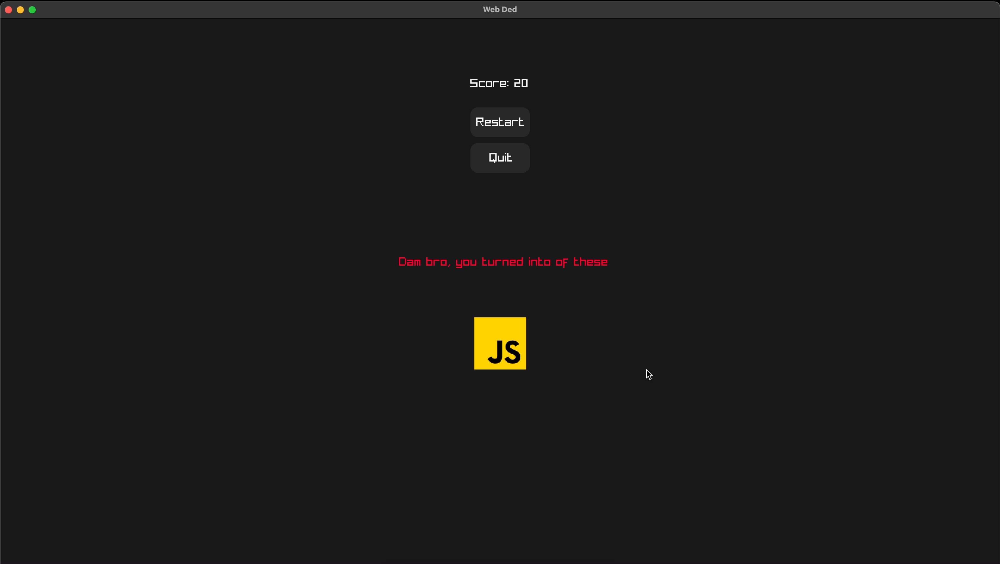
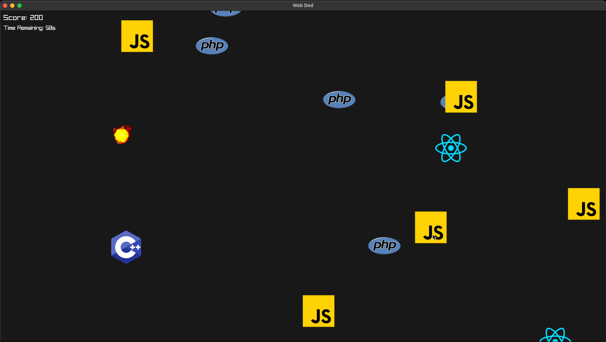

# Web Dhouzz

A C++ space shooter where you blast trash in space because someone has to clean up the mess. Built with raylib and compiles to WebAssembly so you can procrastinate anywhere.








## Getting Started

So you want to build this thing locally? Cool, here's how to not mess it up.

### What You Need

- A Mac (or Linux, probably works)
- Homebrew (if you're on Mac and don't have it, what are you even doing)
- Emscripten (for web builds, obviously)
- Basic knowledge of how terminals work

### Setting Up

First, get raylib installed:

```bash
brew install raylib
```

Clone this repo and don't forget the submodules (raylib is included):

```bash
git clone --recursive https://github.com/najmiter/web-ded.git
cd web-ded
```

### Native Build

For testing locally without the web hassle:

```bash
make
./main
```

### Web Build

For the full web experience (this is what you actually want):

```bash
make web
```

Then serve it however you want. There's a handy script:

```bash
./serve-web.sh
```

Or just open `web/index.html` in your browser if you're feeling adventurous.

### What's What

- `src/` - All the actual game code
- `assets/` - Sprites, sounds, and other fancy stuff
- `web/` - Generated web build output
- `include/raylib-cpp/` - C++ wrapper for raylib because raw C is for masochists

> btw, this readme was generated by ai.
